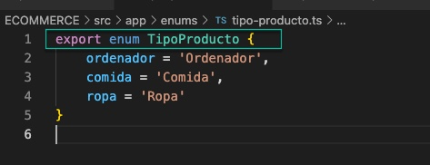

# Explica qué realiza cada una de las siguientes opciones de Angular CLI
## ng new
**ng new** sirve para crear un nuevo proyecto Angular.
~~~~
ng new nombreProyecto
~~~~

## ng generate
La opción **ng generate** nos permite crear elementos dentro de nuestro proyecto, desde componentes, clases, interfaces, etc.

### ng generate component
La opción **component** crea un nuevo componente. Un componente és una parte de nuestra aplicación, por ejemplo, si hablamos de una tienda, un componente podría ser un articulo, donde se define todo lo que va relacionado con artículo:
* fichero **HTML** donde se visualiza el artículo. ***(articulo.component.html)***
* fichero **css** donde se define la presentación. ***(articulo.component.css)***
* fichero **ts** donde se programa la classe con sus atributos y métodos ***(articulo.component.ts)***
* fichero **spec.ts** donde se realizan comprobaciones del archivo ts ***(articulo.component.spec.ts)***

### ng generate directive
Las directivas nos permirte insertar lógica dentro de un archivo **html**, hay directivas ya definidas como **ngIf** para realizar condiciones, **ngFor** para crear bucles, etc.
La instrucción **ng generate directive** permite crear la estructura para crear nuevas directivas.

### ng generate enum
Genera un nuevo tipo **enum** donde podemos definir que valores serán permitidos cuando definimos una nueva variable, vemos el siguiente ejemplo:
~~~~
ng generate enum enums/tipoProducto
~~~~

Aquí vemos un fragmento de código del tipoProducto

### ng generate guard
Los **guard** sirven para definir si se puede o no acceder a alguna ruta, como por ejemplo si el usuario tiene o no permisos.
~~~~
ng generate guard guards/vigilancia
~~~~
Esto genera dos archivos, que uno es 'spec' i el otro és una clase

El código inicial de la clase

### ng generate interface
Genera un nuevo interface, donde podemos definir una estructura como si fuera una clase pero sin implementar los métodos, sólo la estructura. Esto nos permite crear una plantilla que luego se puede heredar en diferentes clases.

~~~~
ng generate interface interfaces/producte
~~~~

genera dentro de la carpeta **interfaces** un archivo con la definición de un interface vacio.

### ng generate pipe

Pipe son transformaciones de formato de un valor, por ejemplo convertir en mayúsculas o minúsculas un text, cambiar formato numérico, etc.

En este caso podemos definir nuevas transformaciones generando de nuevas mediante:

~~~~
ng generate pipe pipes/trasformacions
~~~~

Aquí tenemos el resultado:

### ng generate service

Los servicios son los proveedores de datos, me explico, será la parte de la aplicación que se encargará de gestionar los datos que ha de utilizar nuestra aplicación.

~~~~
ng generate service services/producto
~~~~

## ng serve

Aquí nos permite crear un servidor con la aplicación funcionando en el navegador en tiempo real, si realizamos cambios, estos serán renderizados al momento en el navegador.

~~~~
ng serve
~~~~

Esto veuremos en el navegador

## ng test

Nos permite realizar test unitarios de nuestra aplicación

~~~~
ng test
~~~~

## ng version

No dice que versión tenemos instalada de **angular cli**

~~~~
ng version
~~~~

