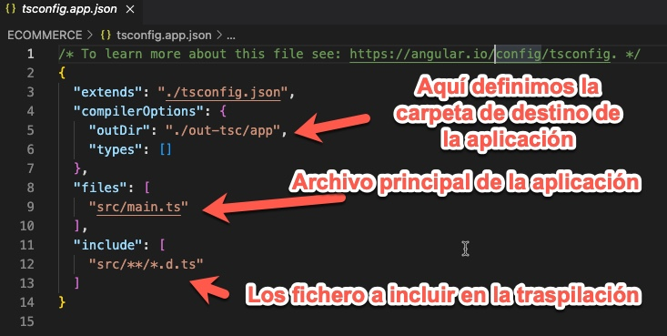
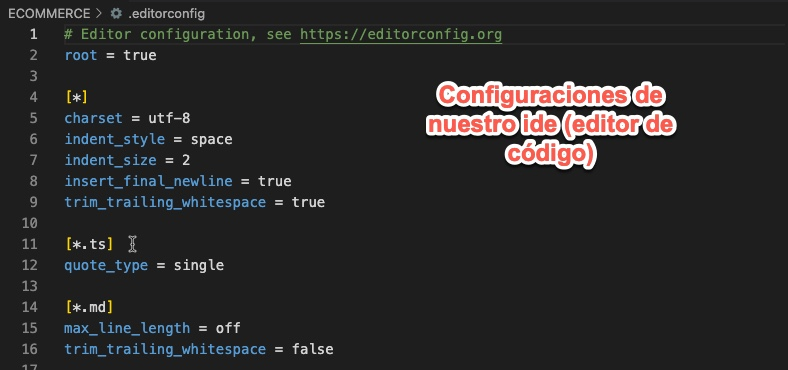
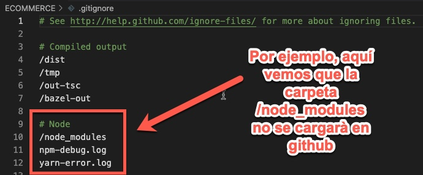
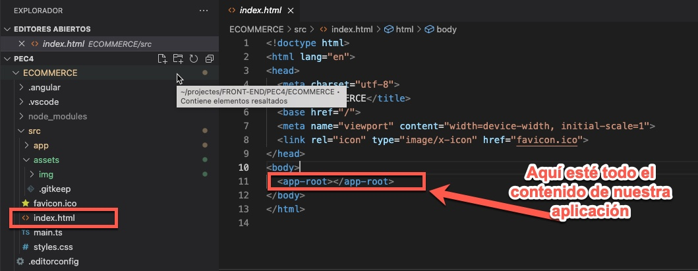
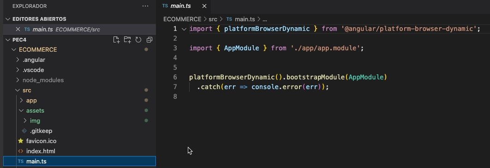
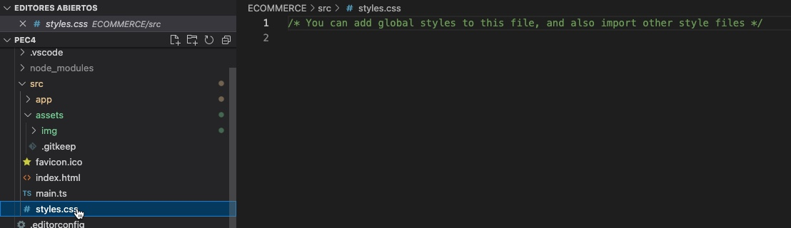

# ¿Qué comando debes utilizar para crear un nuevo proyecto Angular utilizando Angular CLI denominado vinoteca?
Para crear un nuevo proyecto angular utilizaremos la siguiente instrucción

~~~~
ng new vinoteca
~~~~

## Ficheros de configuración en la raíz del proyecto:
### tsconfing.app.json
Este fichero es donde se define la configuracón de typeScript para la compilación del programa.

### angular.json
Aquí se define toda la configuración de nuestra aplicación, por ejemplo cual es el fichero principal, donde se encuentra el codigo fuente, carpeta de destino, configuración de testeo, configuración servidor, etc.

### package.json
Aquí definimos que paquetes (dependencias) necessitamos instal·lar en nuestro proyecto mediante **npm**.

### .editorconfig
Aquí se definen las propiedades o reglas que utilizarà nuestro editor de código (IDE)

### .gitignore
En este fichero podemos definir que carpetas/archivos queremos ignorar con el repositorio **github**

## Directorio node_modules
El directorio **node_modules** es donde estan todos los archivos que instala **npm**, que son dependencias necesarias para que nuestra aplicación funcione correctamentente, estos módulos los instala porqué están definidos en el archivo **package.json**.

## Directorio src
En el directorio **src** se encuentra todo el codigo fuente de nuestra apliocación.

### index.html
Este serà el punto de entrada de nuestra aplicación.

### main.ts
El firchero **main.ts** tiene la lógica inicial de nuestra aplicación AngularJS.

### styles.css
la hoja de estilos global de nuestra aplicación, se aplicarà por defecto a todos los componentes de angular.

### test.ts

### polyfills.ts

## Directorio environments

## Directorio assets

## Directorio app

### Ficheros app.component.*

### Fichero app.module.ts

# Explica cada uno de los siguientes decoradores generados por Angular CLI, detallando cada una de las propiedades que se definen en:

## app.module.ts - @NgModule (declarations, imports, providers, bootstrap).

## app.component.ts - @Component (selector, templateUrl, styleUrls).

# ¿Es posible poder inyectar el template y los estilos en línea de un componente sin necesidad de especificarlos en templateUrl, styleUrls? ¿Es recomendable hacer esto?

