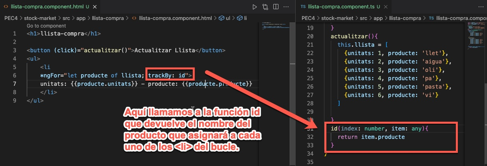

# Explica qué son y cuándo se deberían utilizar las siguientes variables locales de la directiva estructural **NgFor**
La directiva **NgFor** nos permite crear bucles directamente desde **HTML**, veamos que opciones nos brinda:
La directiva **NgFor** tiene valores exportados que podemos asignar a variables locales que podemos utilizar para gestinar nuestras intereacciones, aquí hay un listado:

* index: number: el índice del elemento actual en el iterable.
* count: number: La longitud del iterable.
* first: boolean: Verdadero cuando el elemento es el primer elemento en el iterable.
* last: boolean: Verdadero cuando el elemento es el último elemento del iterable.
* even: boolean: Verdadero cuando el elemento tiene un índice par en el iterable.
* odd: boolean: Verdadero cuando el elemento tiene un índice impar en el iterable. 

# ¿Para qué sirve la opción trackBy de la directiva estructural NgFor? Pon ejemplos de uso.
La opción **trackBy** nos permite identificar cada uno de los elementos de un bucle y de esta manera si actulalizamos la página no recargará todos los elementos de nuevo, sinó que comprobará que elementos se han modificado y sólo cargará los cambios, no toda la lista. Con esto conseguimos optimizar nuestra aplicación.

# ¿Es posible ejecutar dos directivas estructurales simultáneamente? Explica la razón tanto si es si posible como si no lo es.

No es posible, ya que cada directiva hace una acción directa sobre un elemento DOM, no depende de otras directivas.

por ejemplo **'*ngIf'** puede crear un elemento DOM o no crearlo

~~~~

Mostra aquest contingut si és verdader
 
~~~~

Ahora vamos a ver otra directiva la **'ngFor'** que genera un bucle donde se van creando tantos elementos como tendrá el bucle

~~~~

contenido {{elemento}} del bucle

~~~~

Ahora si queremos juntar estas dos directivas tendremos problemas, por ejemplo un **'ngIf'** donde la condición sea *falsa* y seguido de un bucle **'ngFor'** que intentarà realizar un bucle de un elemento que no se va a crear.
