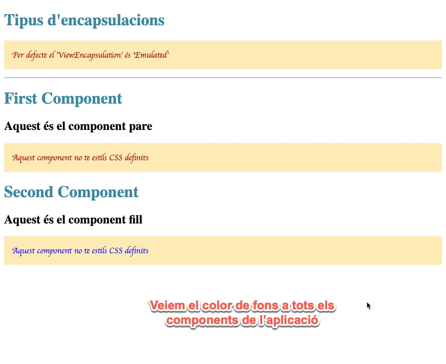

# Ejercicio 6 – Teoria de components
## Quins són els style encapsulation dels components? Posa un exemple d'ús de cadascun d'ells.

Hem definit uns estils generals en el fitxer styles.css que s'aniran aplicant a tota l'aplicació, si un component té un CSS definit, aquest serà el que s'utilitzarà, sinó farà servir el que ve per defecte en styles.css del principal.

Per defecte el 'ViewEncapsulation' és 'Emulated'

Aquí tenim la fulla d'estils predefinida per la nostra aplicació en el fitxer **'stiles.css'**

~~~~
  h1 {
    color: #3888a3; /* purpurina */
  }
  
  p {
    color: #aa0000; /* vermell */
    font-family: sans-serif;
  }
~~~~

Ara anem a crear dins de la nostra aplicació dos components, 'first' i 'second'

~~~~
ng g c first

ng g c second
~~~~

Ara anem a veure els HTML de l'aplicació principal **'app.component.html'**

~~~~
<h1>Tipus d'encapsulacions</h1>

Per defecte el 'ViewEncapsulation' és 'Emulated'

<app-first></app-first> 
~~~~

Dins del fitxer **'first.component.html'** componet tenim el següent HTML

~~~~
<h1>First Component</h1>
<h2>Aquest és el component pare</h2>

Aquest component no te estils CSS definits

<app-second></app-second>
~~~~

Dins del fitxer **'second.component.html'** component tenim el següent HTML

~~~~
<h1>Second Component</h1>
<h2>Aquest és el component fill</h2>

Aquest component no te estils CSS definits

~~~~

Aquí el resultat inicial

Podem observar que l'estil inicial es propaga al reste de components de la nostra aplicació, equest comportament seria l'opció **emulated**

Mirem l'exemple del primer component **'first.component.ts'** i ara declarem el component **emulated**

Resultat:

Podem veure que no ha passat res, degut a que per defecte **Angular** utilitza **emulated** com a encapsulació per defecte.

Ara anem a veure l'opció **ShadowDom**, aquesta opció aïlla qualsevol estil, i el component no tindrà cap estil predeterminat, queda completament aillat.
Anem a veure-ho en el *second* component que és fill del *first* component, i li anem a assignar l'opció d'encapsulació **ShadowDom**

Anem a veure el resultat

Per últim anem a provar de possar en **shadowDom** el component pare **'first'** a veure que passa, el component fill treurem el component **ShadowDom**

first.component.ts (component pare)

second.component.ts (component fill)

Resultat

## Diferència entre **emulated** i **ShadowDom**

* **Emulated** hereda els estils del pare si el fill no te cap CSS assignat, però si el fill té regles CSS assignades, a les hores, només aplicarà aquestes i no heredarà res del pare.
* **ShadowDom** no hereda res, encara que no tingui un CSS assignat

Per últim anem a veure el encapsulat **none**, aquest hereda totes les propietats del CSS i només fa com a pròpies les definides dins del CSS, per exemple, podem definir un color de font groc en els estils de l'aplicació, i en el primer component definim un color de lletra vermell, s'aplicarà el color vermell de la lletra i també heredarà la resta de definicions del pare, el color groc de fons.
A més, ho transmet a fills i pares, a tot arreu.

Resultat

el video perfectament explicat: https://www.youtube.com/watch?v=4dLEILwxuoQ

# Què és el ShadowDom

Queda explicat en l'apartat anterior, resumint, és un tipus encapsulament que aïlla al component i tots els components fills de qualsevol CSS anterior.

# Què és el changeDetection?

Un **changeDetection** és quan es produeix algun canvi, actualització d'un component, això produeix una detecció d'un canvi, servirà per actulitzar canvis dins dels nostres components.

# ¿Quines diferències existeixen entre les estratègies **Default** y **OnPush**? Quan hauríem d'utilitzar una o l'altre? Avantatges i inconvenients.

L'opció **Default**, Angular quan detecta un canvi actualitza tots els components de l'aplicació, això és molt pràctic perquè no hem de gestionar els canvis però per una altra banda si l'aplicació creix molt es tornarà molt poc eficient, consumint un munt de recursos per poder actualitzar tota la informació quan hi hagi un canvi.

L'opció **OnPush** no actualitza tot l'arbre de components, sinó que nosaltres haurem de preveure els canvis i que haurà d'actualitzar, això és més feixuc de gestionar però per una altra banda optimitzarem moltíssim el rendiment i consum de recursos de la nostra aplicació.

# Explica amb detall el cicle de vida dels components. Fes esmena de quan es disparen els **hooks OnChanges, OnInit, AfterViewInit i OnDestroy**, ja que son els més utilitzats.

El cicle de vida dels components son els diferents estats en que es pot trobar un component, pot estar iniciat (**OnInit**) por rebre algun canvi (**OnChanges**) pot ser esborrat (**OnDestroy**).

* **OnInit**: Aquest cicle es dispara quan el component s'està iniciant, aquó podem posar codi que s'executi quan estem iniciant el nostre component, per exemple quan volem assignar classes al component:

* **OnChanges**: Quan hi ha algun canvi de valor o event en el nostre component.

~~~~
@Component({selector: 'my-cmp', template: `...`})
class MyComponent implements OnChanges {
  @Input() prop: number = 0;

  ngOnChanges(changes: SimpleChanges) {
    // changes.prop conté el valor anterior i l'actual ...
  }
}
~~~~

* **OnDestroy**: Quan sortim d'una web per anar a una altre apartat dins de la nostra aplicació, poden quedar informació i processos en funcionament que ja no tindran ninguna utilitat però que estan ocupant menòria i CPU. **OnDestroy** es dispara quan el component es destrueix, i aquí és on nosaltres podem *matar* tots els processos que ja no faria falta utilitzar.

* **AfterViewInit**: Aquest procés es diapararà quan ja tingui la template html carregada i és disposi a carregar elements de vista externs.