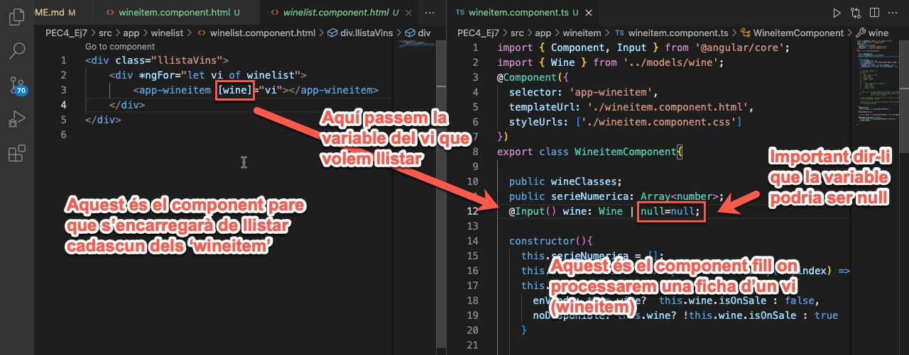
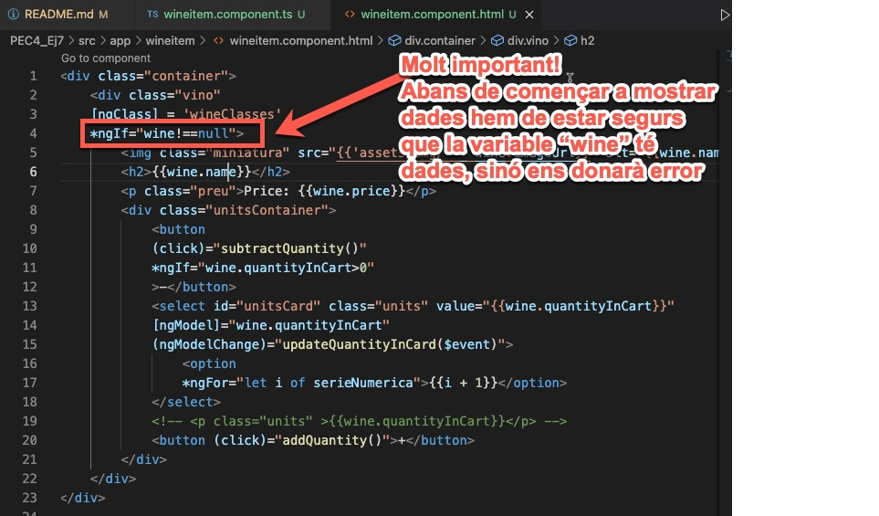

# Apunts
* Volem vincular un component **wineList** amb el component **wineItem** per fer-ho des de el component fill **wineItem** haurem d'incloure a les variables del pare  **wineList** per fer-ho ho farem de la següent manera:

* Aquí una explicació detallada https://www.youtube.com/watch?v=7Y1KpLbMTJw
* També és important el tractament dels 'nulls' dins del fitxer HTML del component fill, en aquest cas la fitxa del vi 'wineitem'

# La variable no reconoce los valores del @input
si volem accedir a un valor que ve donat per un input l'hem de cridar des d' **ngOnInit()**, si ho fem des del contructor la variable sempre donarà el valor inicial, en el nostre cas ***null***.

https://es.stackoverflow.com/questions/322171/error-con-input-angular

# Vincular un control a una variable

* Aquí l'explicació 
  https://www.angularjswiki.com/angular/ngmodelchange-change-angular/
